<div align="center">
  
  <h1>Quiz Master</h1>
  <p><b>Ứng dụng luyện thi trắc nghiệm THPT Quốc Gia</b></p>
</div>

---

## Mô tả dự án

**Quiz Master** là ứng dụng luyện thi THPTQG được xây dựng bằng Flutter. Ứng dụng hỗ trợ học sinh ôn luyện kiến thức, làm bài thi thử theo môn học, xem kết quả, theo dõi lịch sử học tập và tích hợp AI chatbot để hỗ trợ giải thích kiến thức chi tiết.

## Mục tiêu ứng dụng

- Hỗ trợ học sinh ôn luyện và thi thử THPTQG hiệu quả.
- Cung cấp trải nghiệm làm bài trắc nghiệm với thời gian thực trên thiết bị di động.
- Cho phép theo dõi kết quả, lịch sử làm bài và sự tiến bộ cá nhân.
- Xây dựng nền tảng mở rộng để tích hợp các công cụ AI hỗ trợ học tập.

## Tính năng chính

- **Xác thực người dùng:** Đăng nhập, đăng ký tài khoản (Email, Google) và Đăng nhập ẩn danh. Hỗ trợ khôi phục mật khẩu.
- **Ôn luyện theo môn học:** Danh sách các môn học và bộ đề thi tương ứng.
- **Làm bài thi thử:** Giao diện thi thử với đồng hồ đếm ngược, chuyển câu linh hoạt và theo dõi tiến độ.
- **Chấm điểm & Kết quả:** Tự động nộp bài, tính điểm, hiển thị kết quả và xem lại chi tiết đáp án.
- **Quản lý học tập:** Lưu đề thi yêu thích và quản lý lịch sử làm bài.
- **Hồ sơ cá nhân:** Cập nhật thông tin, ảnh đại diện và thay đổi mật khẩu.
- **Chatbot AI (Gemini):** Hỏi đáp trực tiếp với AI, lưu trữ lịch sử trò chuyện.

## Ảnh màn hình ứng dụng

### 1. Đăng nhập & Đăng ký
<p align="center">
  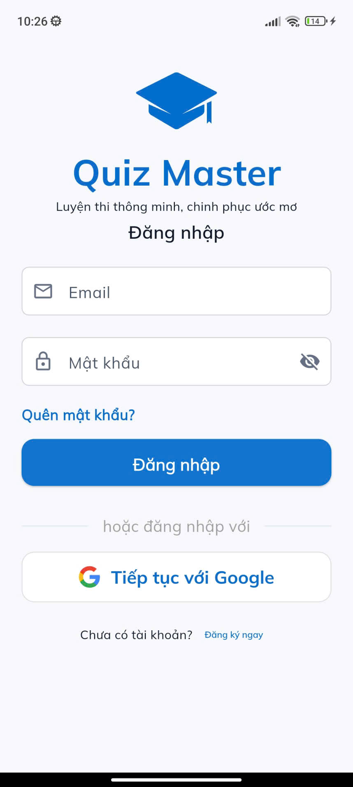&nbsp;&nbsp;&nbsp;&nbsp;
  &nbsp;&nbsp;&nbsp;&nbsp;
  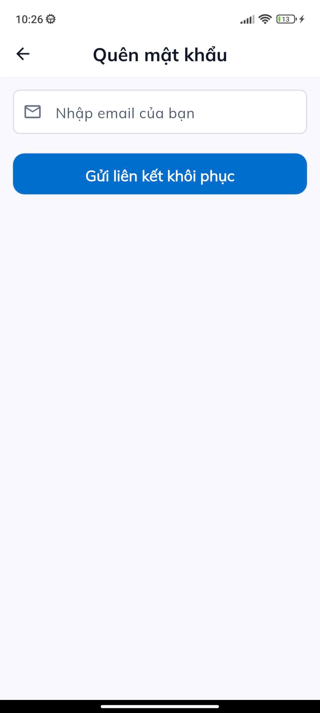
</p>

### 2. Trang chủ & Quản lý đề thi
<p align="center">
  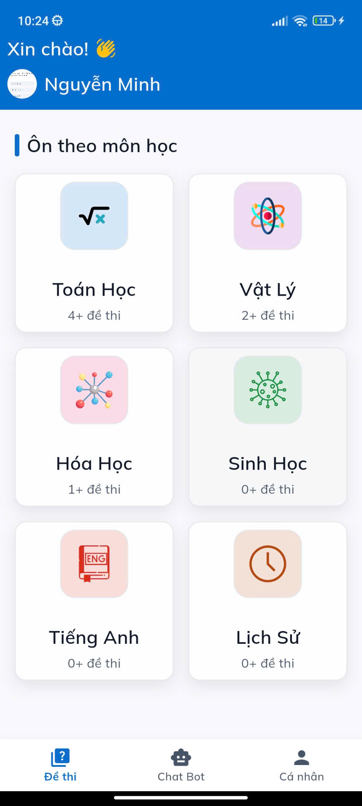&nbsp;&nbsp;&nbsp;&nbsp;
  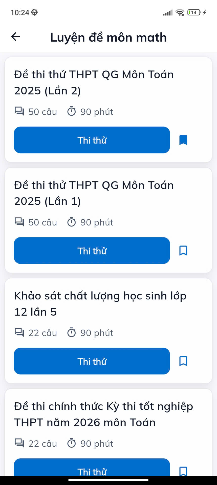&nbsp;&nbsp;&nbsp;&nbsp;
  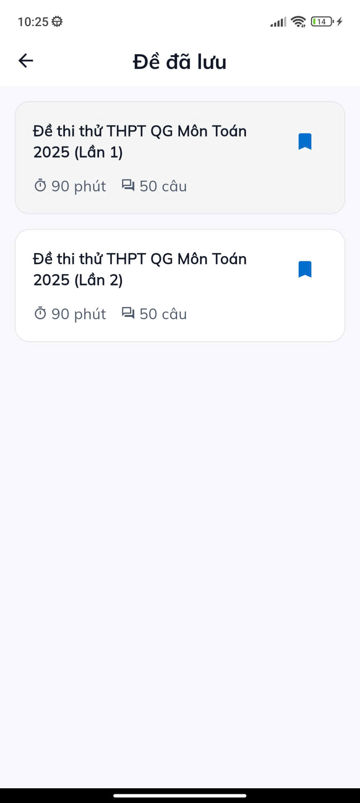
</p>

### 3. Làm bài thi & Lịch sử học tập
<p align="center">
  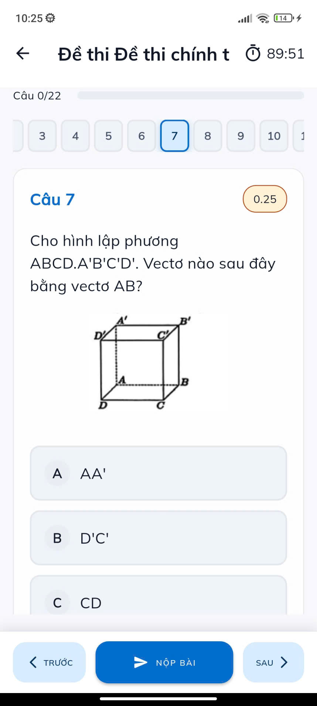&nbsp;&nbsp;&nbsp;&nbsp;
  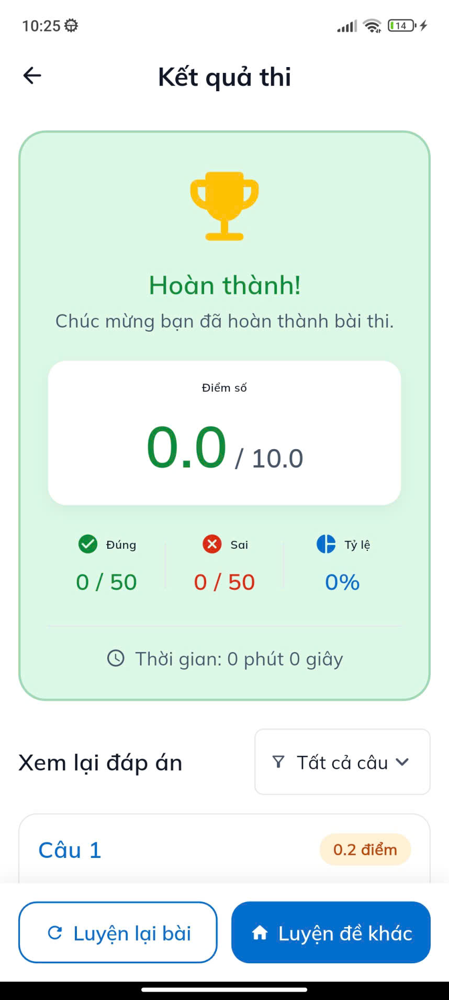&nbsp;&nbsp;&nbsp;&nbsp;
  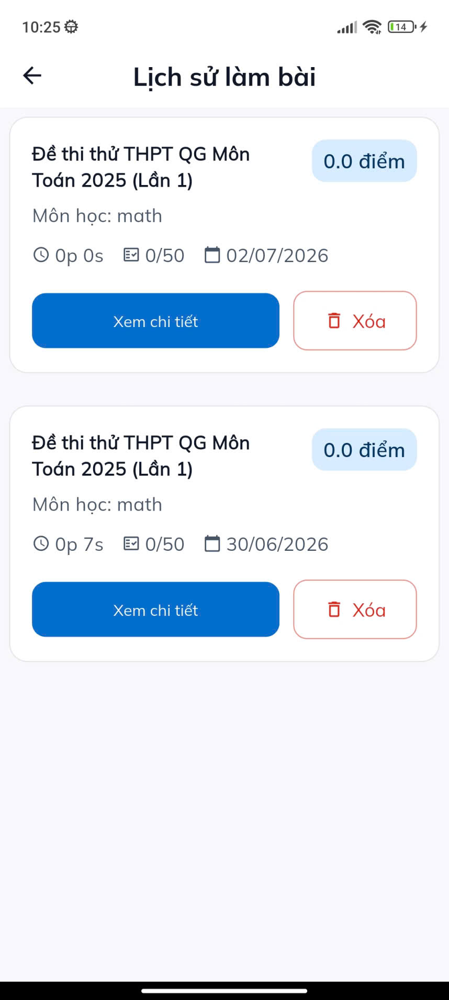
</p>

### 4. Quản lý hồ sơ
<p align="center">
  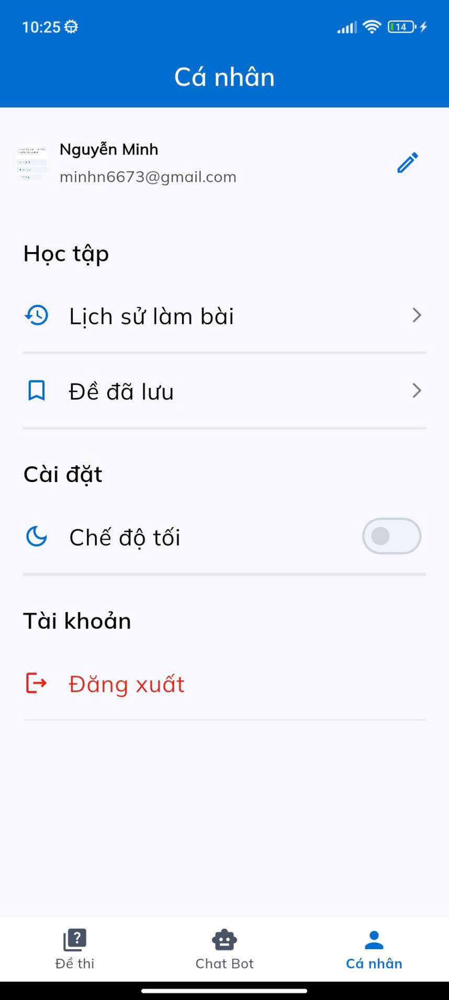&nbsp;&nbsp;&nbsp;&nbsp;
  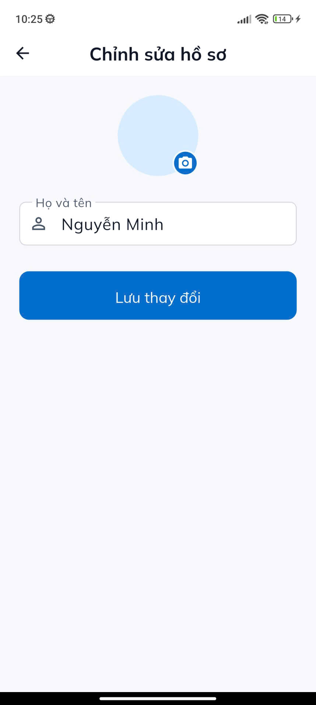
</p>

### 5. Chatbot AI hỗ trợ
<p align="center">
  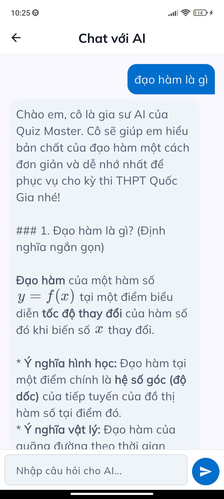&nbsp;&nbsp;&nbsp;&nbsp;
  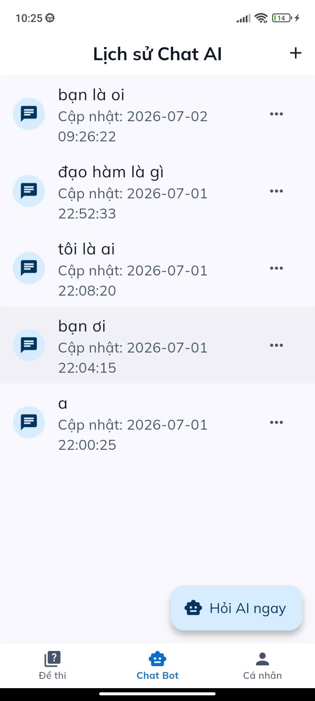
</p>

## Công nghệ sử dụng

- **Frontend:** Flutter, Dart.
- **State Management:** Flutter Bloc, Cubit.
- **Routing:** GoRouter.
- **Backend & Database:** Firebase Authentication, Cloud Firestore, Firebase Storage.
- **AI Integration:** Google Gemini AI (firebase_ai).
- **Thiết kế:** Material Design 3.
- **Môi trường:** flutter_dotenv.

## Kiến trúc dự án

Dự án được tổ chức theo mô hình **Clean Architecture** kết hợp **Feature-first**, chia thành các layer chính:
- **Presentation:** Giao diện người dùng (UI, Screens, Widgets) và logic trạng thái (Bloc/Cubit).
- **Domain:** Core logic nghiệp vụ, bao gồm Entities, UseCases và Interface (abstract classes) cho Repositories.
- **Data:** Triển khai các Repositories, xử lý giao tiếp dữ liệu thông qua Models, Remote Data Sources (Firebase) và Local Data Sources.

**Lợi ích:**
- Tách biệt UI và logic nghiệp vụ.
- Dễ dàng bảo trì và kiểm thử độc lập.
- Khả năng mở rộng tính năng cao.

## Cách cài đặt và chạy dự án

1. **Clone repository:**
   ```bash
   git clone https://github.com/Minh-lab/Quiz-Master.git
   cd "Quiz Master/Application/quiz_master_application"
   ```

2. **Cài đặt thư viện:**
   ```bash
   flutter pub get
   ```

3. **Cấu hình môi trường:**
   Tạo file `.env` tại thư mục gốc và cấu hình:
   ```env
   GOOGLE_SERVER_CLIENT_ID=your_google_client_id_here
   ```

4. **Kết nối Firebase:**
   Đảm bảo dự án có sẵn cấu hình Firebase hợp lệ (`google-services.json` cho Android, `GoogleService-Info.plist` cho iOS).

5. **Chạy ứng dụng:**
   ```bash
   flutter run
   ```